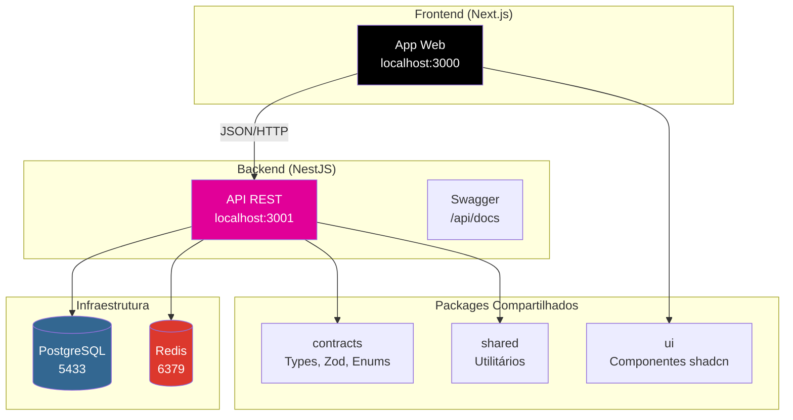
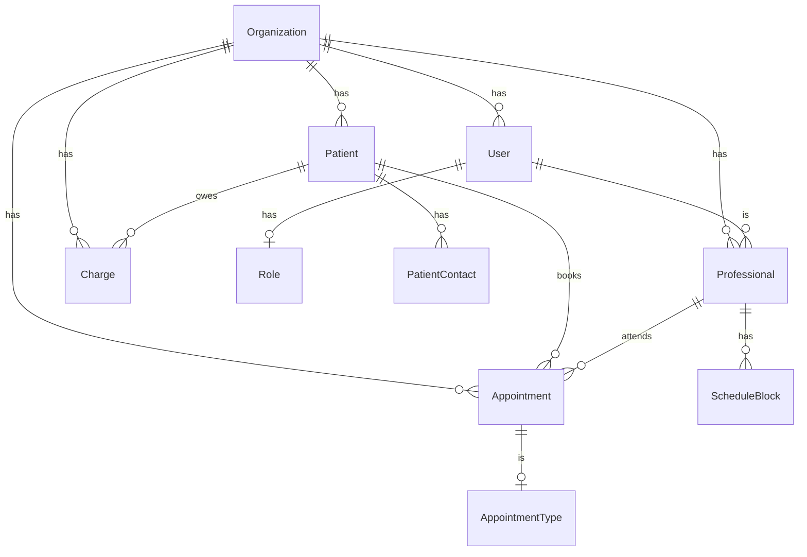

# Clínica SaaS

[](https://www.typescriptlang.org/)
[](https://nestjs.com/)
[](https://nextjs.org/)
[](https://www.prisma.io/)
[](https://www.postgresql.org/)

> Sistema de gestão completo para clínicas e consultórios médicos. SaaS multi-tenant com controle de acesso baseado em papéis (RBAC), agenda inteligente e dashboard operacional.

---

## Funcionalidades

| Categoria | Módulos |
|-----------|---------|
| **Identidade** | Login, registro, recuperação de senha, JWT com access/refresh tokens |
| **Gestão** | Usuários, organizações (clínicas), roles e permissões granulares |
| **Clínica** | Pacientes com múltiplos contatos, profissionais de saúde |
| **Agenda** | Agendamentos com calendário, validação de conflitos, bloqueios |
| **Operações** | Comunicações, documentos, tarefas |
| **Financeiro** | Cobranças, pagamentos, status automático (pendente/pago/vencido) |
| **Análise** | Dashboard com KPIs, comparação temporal e drill-down |
| **Integração** | Worker para Email/WhatsApp (em desenvolvimento) |

---

## Arquitetura



---

## Quick Start

```bash
# 1. Clone e instale dependências
git clone <repositorio>
cd clinica-saas
yarn install

# 2. Inicie a infraestrutura (PostgreSQL + Redis)
cd infra && docker compose up -d

# 3. Configure o banco de dados
npm run db:push

# 4. Inicie os serviços de desenvolvimento
npm run dev:api    # Backend (porta 3001)
npm run dev:web    # Frontend (porta 3000)
```

Acesse:
- **Frontend**: http://localhost:3000
- **API**: http://localhost:3001/api/v1
- **Swagger**: http://localhost:3001/api/docs

---

## Módulos do Sistema

### 1. Autenticação e Autorização
- Login/logout com JWT
- Registro de usuários
- Recuperação de senha
- Access token (15min) + Refresh token (7 dias)
- Rate limiting no login

### 2. Gestão de Organizações (Multi-tenant)
- CRUD de clínicas/organizações
- Isolamento de dados por organização
- Cadastro com CNPJ, email, telefone, endereço

### 3. Gestão de Usuários
- CRUD de usuários
- Atribuição de roles
- Vinculação com organização

### 4. RBAC (Roles e Permissões)
| Role | Descrição |
|------|-----------|
| `super_admin` | Administrador global - todas as operações |
| `org_admin` | Administrador da organização - CRUD completo |
| `professional` | Profissional de saúde - ver pacientes, atender |
| `receptionist` | Recepcionista - agendar, gerenciar agenda |
| `support` | Suporte técnico - apenas leitura |

**Permissões granulares:** `users.read`, `users.write`, `organizations.read`, `patients.read`, `appointments.write`, etc.

### 5. Gestão de Pacientes
- Cadastro com dados pessoais e endereço
- Múltiplos contatos (emergência, responsável)
- Busca por nome, CPF, telefone
- Soft delete com auditoria

### 6. Agenda e Agendamentos
- CRUD de agendamentos
- Tipos de atendimento com duração definida
- Status: scheduled, confirmed, in_progress, completed, cancelled, no_show
- Validação de conflitos de horário
- Bloqueios de agenda (férias, folgas)
- Visão diária, semanal, mensal

### 7. Profissionais de Saúde
- Cadastro com especialidade
- Cor para identificação visual
- Vinculação com usuário do sistema

### 8. Comunicações
- Envio de mensagens
- Templatespersonalizáveis

### 9. Documentos
- Upload e gestão de arquivos
- Armazenamento seguro

### 10. Tarefas
- Criação e acompanhamento de tarefas
- Status: pending, in_progress, completed, cancelled

### 11. Financeiro
- CRUD de cobranças
- Registro de pagamentos
- Status automático: pending, paid, overdue, cancelled
- Métodos: cash, credit, debit, pix, transfer

### 12. Dashboard
- KPIs de todas as áreas
- Comparação temporal (hoje vs ontem, mês atual vs anterior)
- Line e bar charts
- Drill-down completo

### 13. Integrações (Em desenvolvimento)
- Worker com BullMQ
- Provedores de email (SendGrid/Resend)
- Provedores de WhatsApp (Twilio)
- Automaçõesbaseadas em eventos

---

## Stack Tecnológico

| Camada | Tecnologia |
|--------|-----------|
| **Runtime** | Node.js >= 20 |
| **Backend** | NestJS 10.x |
| **Frontend** | Next.js 14.x (App Router) |
| **ORM** | Prisma 5.x |
| **Banco** | PostgreSQL 16 |
| **Cache** | Redis 7 |
| **UI** | React 18.x + Tailwind CSS + shadcn/ui |
| **Estado** | TanStack React Query |
| **Autenticação** | Passport JWT + bcrypt |
| **Validação** | class-validator + Zod |
| **Container** | Docker + Docker Compose |
| **Package Manager** | Yarn 1.x |

---

## Estrutura do Repositório

```
clinica-saas/
├── apps/
│   ├── api/                    # Backend NestJS
│   │   ├── src/
│   │   │   ├── modules/        # Módulos de domínio
│   │   │   ├── common/         # Componentes compartilhados
│   │   │   └── prisma/         # Schema do banco
│   │   └── package.json
│   ├── web/                    # Frontend Next.js
│   │   ├── src/
│   │   │   ├── app/            # App Router
│   │   │   ├── components/     # Componentes React
│   │   │   ├── lib/            # Utilitários
│   │   │   └── hooks/          # Custom hooks
│   │   └── package.json
│   └── worker/                 # Background jobs (reservado)
├── packages/
│   ├── contracts/              # Tipos, schemas Zod, enums
│   ├── shared/                 # Utilitários comuns
│   └── ui/                     # Componentes UI (shadcn)
├── docs/                       # Documentação
│   ├── specs/                  # Especificações de features
│   ├── ARCHITECTURE.md
│   └── DOMAIN.md
└── infra/                      # Docker Compose
```

---

## Entidades do Domínio



---

## Credenciais de Teste

O sistema inclui dados de seed para testes:

| Email | Senha | Role |
|-------|-------|------|
| `admin@clinicademo.com.br` | `Admin123` | org_admin |
| `suporte@clinicademo.com.br` | `Support123` | support |

**Organização seedada:** Clínica Demo (CNPJ: 00.000.000/0001-00)

---

## Scripts Disponíveis

```bash
# Desenvolvimento
npm run dev:api        # Inicia backend (porta 3001)
npm run dev:web        # Inicia frontend (porta 3000)
npm run dev:kill       # Para servidores de dev

# Build
npm run build          # Build completo
npm run build:api      # Build backend
npm run build:web      # Build frontend

# Database
npm run db:generate    # Gera Prisma Client
npm run db:push        # Cria tabelas no banco
npm run db:migrate     # Executa migrations

# Qualidade
npm run lint           # Executa ESLint
npm run lint:fix       # Corrige problemas de lint
npm run format         # Prettier formatação
npm run typecheck      # Verificação de tipos
npm run test           # Executa testes
```

---

## Padrões de Código

- **TypeScript**: Strict mode
- **Linting**: ESLint + Prettier
- **Nomenclatura**:
  - Variáveis: `camelCase`
  - Classes/Componentes: `PascalCase`
  - Arquivos: `kebab-case`
- **Commits**: Conventional commits (`feat:`, `fix:`, `docs:`, `refactor:`)
- **Feature branch**: Uma feature por branch, squash ao merge

---

## Documentação Adicional

| Arquivo | Descrição |
|---------|-----------|
| [docs/ARCHITECTURE.md](docs/ARCHITECTURE.md) | Arquitetura detalhada do sistema |
| [docs/DOMAIN.md](docs/DOMAIN.md) | Modelo de domínio e entidades |
| [docs/specs/](docs/specs/) | Especificações completas de cada módulo |

Acesse o Swagger em http://localhost:3001/api/docs para ver todos os endpoints da API.

---

## Troubleshooting

### PostgreSQL não inicia
```bash
# Verificar se há conflito com instalação local
sudo systemctl stop postgresql  # Linux
# ou alterar porta no docker-compose.yml
```

### Erro de conexão com banco
```bash
# Verificar se o container está rodando
docker ps

# Ver logs do container
docker logs clinica-saas-postgres
```

### Build falha
```bash
# Limpar cache e reinstallar
rm -rf node_modules apps/*/node_modules
yarn install
npm run build
```

---

## Licença

Privado - Todos os direitos reservados